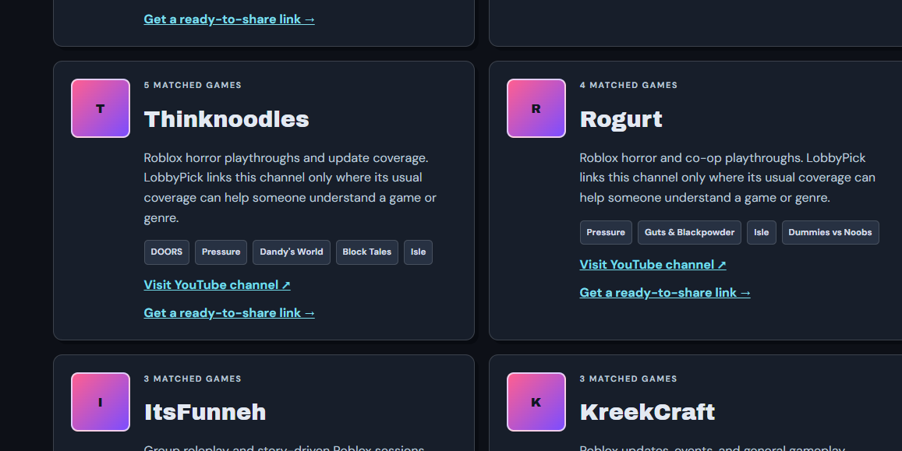

# LobbyPick

**A Roblox game finder for groups that cannot agree on what to play.**

[Visit LobbyPick](https://lobbypick.com)

I started LobbyPick because choosing a Roblox game with friends was taking longer than it should. Most lists showed the same popular games, but they did not answer the questions my group actually cared about: how many people can join, whether the game works well on mobile, how long a session usually takes, and whether everyone is in the mood for horror, competition, or something more relaxed.

I wanted the site to feel more like a useful decision tool than another long directory. A player can choose a few preferences, set dealbreakers, and get a smaller group of games that makes sense for that situation.

## What I built

LobbyPick includes a catalog of 200 Roblox games, including 50 smaller or lesser-known picks. The site lets users narrow the list by party size, mood, device, session length, private-server availability, voice chat, and other practical details.

I also added:

- Weighted recommendations instead of strict all-or-nothing filtering
- Search, sorting, random picks, and local shortlists
- Shareable links that reopen the same filter choices
- Individual guides for selected games
- Group-size, mobile, horror, party, and short-session guide pages
- A Roblox creator directory connected to relevant games
- Submission and correction forms
- Responsive layouts for phones, tablets, and desktop screens
- Search metadata, structured data, canonical links, a sitemap, and robots rules

The main site does not require an account. I wanted someone to open it, make a choice, and send the result to friends without creating another login.

## What this repository is

This is the public case-study version of LobbyPick. I am keeping the full production repository private because it contains the complete game catalog, deployment setup, analytics configuration, submission handling, and other operational files.

This public version includes:

- The project background
- Product and design decisions
- Testing notes
- A screenshot from the creator directory
- Simplified code samples for matching, mobile layout, and structured data

It is meant to show how I approached the project without publishing the entire live codebase.

## My role

My role

I handled the project from the original idea through testing and launch preparation. My work included deciding which questions the finder should ask, organizing the game catalog, reviewing page layouts, adding game-guide and creator content, setting up SEO elements, and testing the site across different screen sizes.

A large part of the work involved revision. I opened each build, tested the actual pages, recorded anything confusing or broken, and revised it. Some fixes were small, such as improving text contrast. Others required changing how the site loaded media or ranked game recommendations.

I used AI-assisted development tools during the project, but every build went through my own review and testing. I identified problems, revised the requirements, tested the changes again, and kept only the parts that worked.

## A few decisions that shaped the site

### I did not make every filter strict

One early problem was that exact filtering could leave the user with no results. For example, a group might prefer a short game, but that does not mean every medium-length game should disappear.

I separated answers into preferences and dealbreakers. Preferences affect the score. Dealbreakers remove a game completely. This made the recommendations more useful without ignoring requirements such as device support.

[View the simplified matching sample](samples/weighted-matching.js)

### I changed the mobile layout instead of only shrinking the desktop version

The first mobile versions were too cramped. Some controls were hard to tap, cards felt crowded, and older responsive rules were overriding newer fixes.

I changed the layout to use one main column, larger touch targets, stacked actions, and shorter spacing. I also added a final mobile stylesheet so the phone-specific rules would not be overwritten by older breakpoints.

[View the responsive CSS sample](samples/mobile-layout.css)

### I stopped trying to refresh media for the entire catalog

Loading artwork for all 200 games at once created too many requests and made the first load depend heavily on the Roblox media service.

The later version uses a local media manifest for the catalog. A fresh request is made only when someone opens a specific game. If that request fails, the local record still gives the page something to display.

### I kept creator links separate from endorsements

The creator directory connects channels to games they commonly cover. I changed the wording after realizing that the first version could make the relationship look like an endorsement.

Each card now explains that the channel is listed only because its usual content may help someone understand that game or genre.

## Problems I found while testing

Some of the most useful changes came from problems that were visible only after opening the site:

- Dark text became difficult to read on some dark cards.
- A few creator and guide links pointed to the wrong destination.
- Some game artwork looked clickable but did not open the full guide.
- Earlier mobile styles overrode newer fixes.
- Loading media for the entire catalog created unnecessary requests.
- Some structured-data links still used pre-launch paths.
- Certain sections became much too long on smaller screens.

I kept these issues in the case study because they show more of the actual development process than a perfect final screenshot would.

[Read the testing notes](docs/testing-notes.md)

[Read the project decisions](docs/project-decisions.md)

## Validation work

Before packaging a release, I checked the site for broken links, missing assets, duplicate IDs, JavaScript syntax errors, media fallbacks, and responsive behavior.

The final package included:

- 53 HTML pages
- 19 JavaScript and module files
- 200 unique game records
- 50 hidden-gem records
- 200 media-manifest entries

I also opened the rendered pages on narrow mobile layouts because automated checks did not catch visual problems such as poor contrast, cramped spacing, or controls that were technically present but difficult to use.

## What I learned

The main lesson from LobbyPick was that adding more features did not automatically make the site better. The biggest improvements usually came from reducing friction: fewer unnecessary requests, clearer wording, stronger contrast, better mobile spacing, and links that opened exactly where a user expected.

I also learned that a large catalog and a strong search presence are different problems. The finder can contain 200 games, but only some of them currently have full guide pages. I would rather publish a smaller number of useful guides than create 200 thin pages with very little information.

## What I would work on next

The next improvements would be:

- Add substantial guides for more lesser-known games
- Add automatic checks for changed Roblox and YouTube links
- Improve screenshots for games with limited media
- Make the public submission review process easier to manage
- Use real visitor behavior to remove filters people rarely use

## Tools used

HTML, CSS, JavaScript, JSON-LD, GitHub, browser responsive testing, Google Analytics, Google Search Console, and Cloudflare Pages.

## Project note

LobbyPick is an independent project and is not affiliated with or endorsed by Roblox Corporation. Roblox names and artwork belong to their respective owners.
